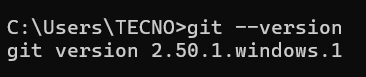
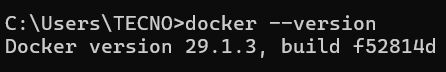
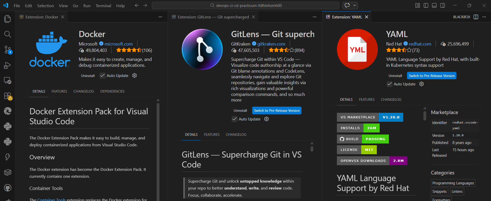

# Laporan Praktikum Pertemuan 01: Setup Environment & Pengantar DevOps

## Identitas Mahasiswa
- **Nama:** Fadilah Tun Hazimah
- **NIM:** 105841118323
- **Program Studi:** Informatika
- **Institusi:** Universitas Muhammadiyah Makassar

## 1. Definisi DevOps
DevOps merupakan sebuah paradigma dan kultur rekayasa perangkat lunak yang mengintegrasikan proses pengembangan (*Development*) dan operasional teknologi informasi (*Operations*). Pendekatan ini bertujuan untuk mendobrak batasan silos tradisional antara kedua entitas tersebut guna mencapai siklus hidup pengembangan sistem yang kolaboratif, otomatis, dan berkesinambungan.

## 2. Signifikansi dan Urgensi DevOps
Implementasi praktik DevOps esensial dalam industri perangkat lunak modern karena memberikan beberapa keuntungan strategis operasional:
* **Akselerasi Delivery:** Memungkinkan pengiriman rilis fitur, pembaruan, dan perbaikan *bug* secara lebih masif dan terukur melalui *Continuous Integration/Continuous Deployment* (CI/CD).
* **Skalabilitas dan Reliabilitas:** Memfasilitasi pengelolaan infrastruktur secara terprogram, meminimalisasi intervensi manual yang rentan terhadap *human error*, sehingga sistem lebih stabil.
* **Efisiensi Alur Kerja:** Mengeliminasi *waste* dalam proses kerja repetitif melalui otomatisasi, memungkinkan tim engineer untuk fokus pada pengembangan inovasi.

## 3. Dokumentasi Setup Environment
Berikut adalah dokumentasi tangkapan layar dari *development environment* yang telah dikonfigurasi untuk kebutuhan praktikum:

### 3.1. Verifikasi Instalasi Git

### 3.2. Verifikasi Instalasi Docker

### 3.3. Verifikasi Ekstensi Visual Studio Code
