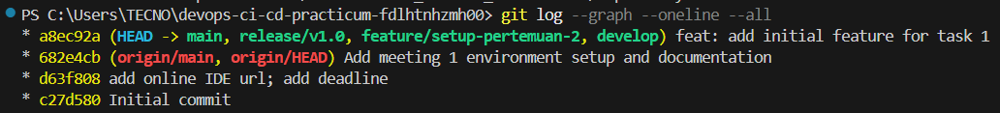
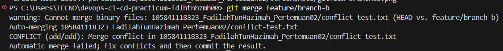

# Laporan Praktikum Pertemuan 02: Git Advanced & Branching Strategies

## Identitas Mahasiswa
- **Nama:** Fadilah Tun Hazimah
- **NIM:** 105841118323
- **Program Studi:** Informatika
- **Institusi:** Universitas Muhammadiyah Makassar

## 1. Implementasi GitFlow
GitFlow merupakan model *branching* yang terstruktur untuk mengelola proyek berskala besar. Alur kerja ini mendefinisikan peran spesifik untuk setiap *branch* dan kapan mereka harus berinteraksi:
* **`main`**: Mencerminkan *state* produksi yang stabil.
* **`develop`**: Berfungsi sebagai *integration branch* untuk fitur-fitur yang sedang dikembangkan.
* **`feature`**: *Branch* berumur pendek untuk mengembangkan fitur spesifik, di-checkout dari `develop` dan di-merge kembali ke `develop`.
* **`release`**: *Branch* transisi sebelum *deployment* ke `main` untuk finalisasi.

Pada praktikum ini, implementasi GitFlow berhasil dieksekusi melalui pembuatan *feature branch*, integrasi ke `develop`, pembuatan *release branch*, dan finalisasi di *branch* `main`.

### Screenshot GitFlow Branches

## 2. Resolusi Merge Conflict
*Merge conflict* terjadi ketika Git tidak dapat mengintegrasikan dua modifikasi kode secara otomatis, umumnya diakibatkan oleh perubahan pada baris kode yang sama di file yang sama dari dua *branch* yang berbeda. 

Resolusi dilakukan secara manual dengan menganalisis *Current Change* dan *Incoming Change*, memutuskan blok kode mana yang akan dipertahankan, membersihkan *marker* dari Git (`<<<<<<<`, `=======`, `>>>>>>>`), lalu melakukan *commit* resolusi.

### Screenshot Merge Conflict
